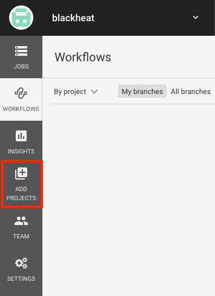
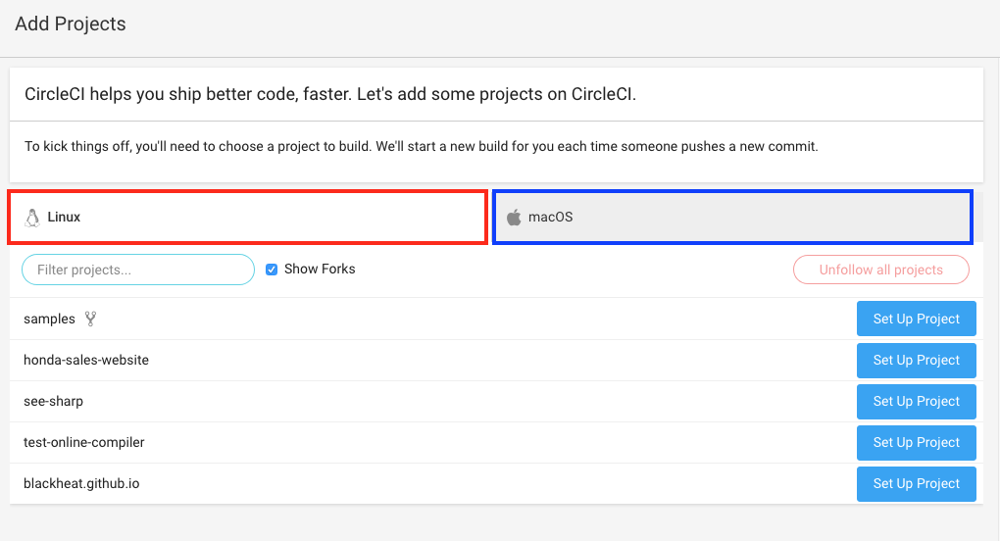
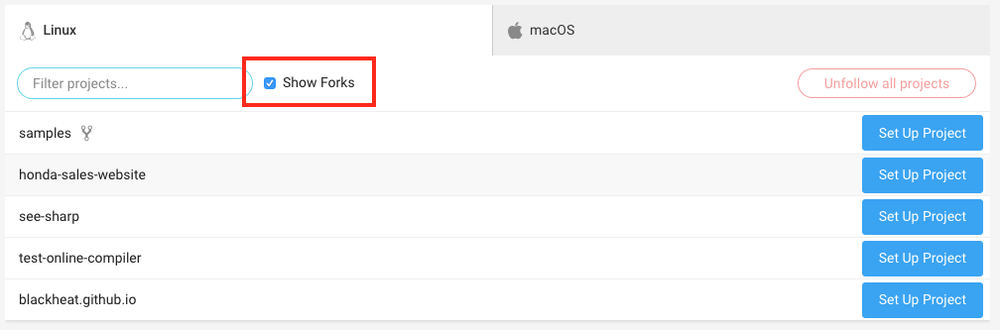
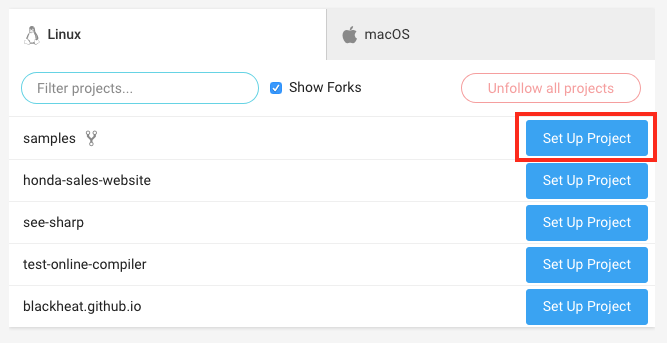
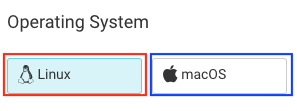
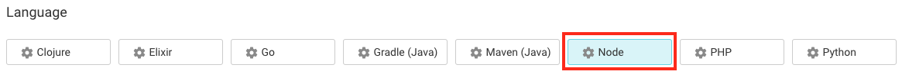
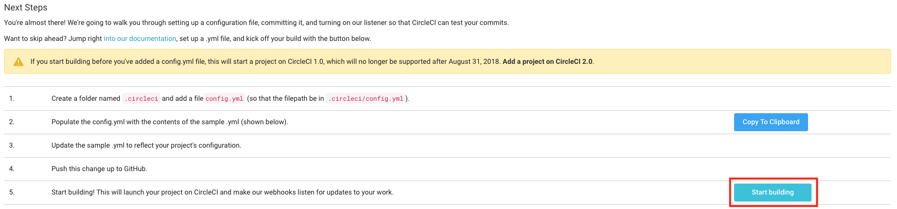

# CircleCI Integration
This guide will demonstrate how to configure CircleCI and run your test script with Kobiton on CircleCI.
> Note: The configuration file used in the example is based on CircleCI 2.0 configuration file format.

## Table of contents
[Prerequisites](#prerequisites)

[1. Configuring GitHub repository to be used with CircleCI](#1.-configuring-github-repository-to-be-used-with-circleci)

[2. Integrating CircleCI with configured GitHub repository](#2.-integrating-circleci-with-configured-github-repository)

## Prerequisites
- An active CircleCI subscription.
    > - If you don't have an account, please go to [here](https://circleci.com/signup/) and follow their instructions to create an account.
    > - If you have an account but have used all remaining minutes, please go to [here](https://circleci.com/gh/organizations/blackheat/settings#containers) and follow their instructions to purchase more usage time.
- A blank GitHub repository.

## 1. Configuring GitHub repository to be used with CircleCI
> If you have a blank, configured repository to be used with CircleCI or you have known how to do it, skip this step.

1. In the repository's root directory, create a folder named `.circleci`
2. Inside the `.circleci` folder, create a file named `config.yml` with the content below
```
version: 2
jobs:
  build:
    working_directory: ~/sample
    docker:
      - image: circleci/ruby:latest-node-browsers
    steps:
      - checkout
      - run:
          name: hello
          command: 'echo Hello'
```

## 2. Integrating CircleCI with configured GitHub repository
This part will demonstrate how to integrate and synchronize CircleCI with a GitHub repository. If you have already known how to do it, skip this step.

Go to [CircleCI portal](https://circleci.com/dashboard)

Click `Add Projects` button in the left panel of the page.



In the `Add Projects` window, you will see two operating systems options, `Linux` (marked **red**) and `macOS` (marked **blue**) as shown below.



Choose the OS that your project is compatible with. In this example, we will be using `Linux`.

If your project is a forked project, tick `Show Forks` to show all forked projects.



In the list of displayed repositories, click `Set Up Project` in the repository you want to integrate CircleCI with



In `Operating System` section, click `Linux` if you want to build and execute your project on `Linux` or `macOS` if on `macOS`. In this example, we will be executing scripts on Linux, therefore, click `Linux`



In `Language` section, choose the programming language that your repository will be built and executed. In this example, we will be using NodeJS, therefore, click `NodeJS`



In `Next Steps` section, click `Start Building`



The setup process will take place in a few moments and your repository will be ready to use with CircleCI.

In the [next](./Integrate-Kobiton.md) part, we will be guiding on how to configure and run your automated test script(s) on CircleCI with Kobiton.