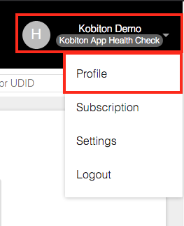
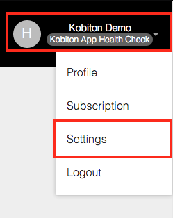
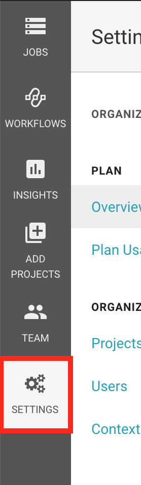
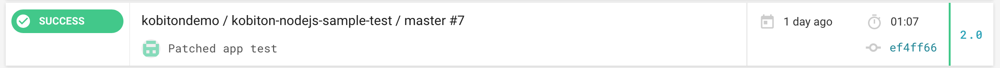
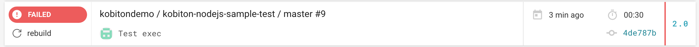
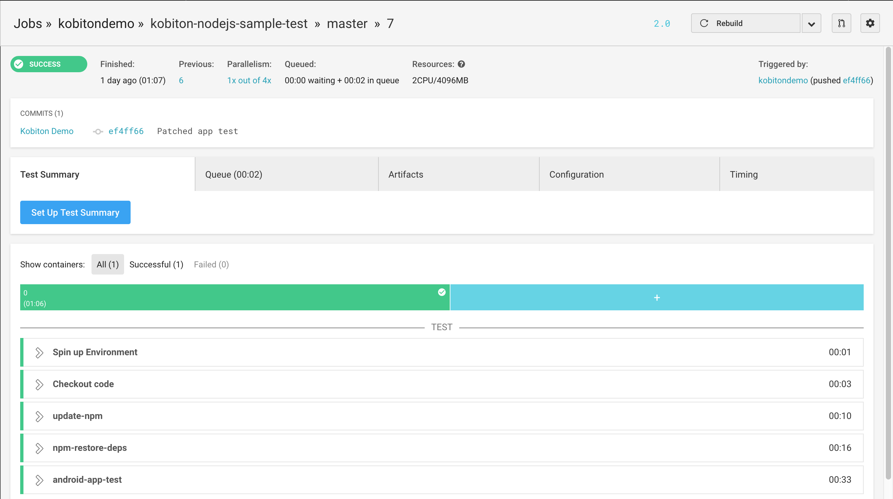

# Running automation tests with Kobiton
This guide will demonstrate how to configure CircleCI and run your test script with Kobiton on CircleCI.
> Note: The configuration file used in the example is based on CircleCI 2.0 configuration file format.

## Table of contents
[Prerequisites](#prerequisites)

[1. Writing automation test scripts](#1.-writing-automation-test-scripts)

[2. Getting required parameters](#2.-getting-required-parameters)

[3. Setting parameters and desired capabilities](#3.-setting-parameters-and-desired-capabilities)

[4. Configuring CircleCI](#4.-configuring-circleci)

[5. Viewing execution result in CircleCI](#5.-viewing-execution-result-in-circleci)

[6. Viewing Kobiton test session information](#6.-viewing-kobiton-test-session-information)

## Prerequisites
- An active Kobiton subscription.
- A repository configured to be used with CircleCI
    > - If you haven't had one, refer to the [previous](./Integrate-CircleCI.md) part on how to configure a repository to be used with CircleCI.

### 1. Writing automation test script(s)
> You can visit [our blog](https://kobiton.com/blog/automation-web-appium-kobiton-nodejs/) for details on how to set up an automation test script.

In this guideline, we will be using the sample test script provided by Kobiton.
- Clone [this](https://github.com/kobiton/samples.git) repository into a folder and navigate into it.
- The test samples are provided in many languages. In this example, we will be using the one written in NodeJS, therfore, navigate into `NodeJS` folder.
- You will see many testing scripts. In this guide, we will be using the sample Android application testing script `android-app-test.js`.
- Put `android-app-test.js` and `package.json` in your repository.

### 2. Getting required parameters
In order to execute test(s) on Kobiton, three parameters must be provided : 

- Username : Your Kobiton account's username.
- API Key : Your Kobiton account's API key.
- Desired Capabilities : Device's desired capabilities, which is used to identify and configure the device you want to test.

In this part, we will be guiding on how to get these elements.

**Follow these steps to get your username**

1. Go to [Kobiton Portal page](https://portal.kobiton.com)
2. In the upper right corner of the page, click on your name.


3. In the dropdown menu, click `Profile`



4. Your should see your username, as the following example


**Follow these steps to get your API Key**

1. Go to [Kobiton Portal page](https://portal.kobiton.com)
2. In the upper right corner of the page, click on your name.


3. In the drop down menu, click `Settings`



4. Your should see your API key, as the following example


**Follow these steps to get the desired capabilities**

1. Go to [Kobiton Devices page](https://portal.kobiton.com/devices)
2. At the top left of the page, you will see the device status filter (`online`, `busy`, `offline`)


3. Tick `Online` and untick the two remaining options in order to display only online devices


4. Hover over the device you want to run your test script on, click on the gear button, as shown in the example


In this example, we will be running tests on `Pixel 2 XL`, therefore, hovering over it and click on the gear button.


5. In the popup window, choose the language that your script will be written in (marked **red**), change the value of `Session name`, `Description`, `App Type`, etc. The desired capabilities code will be generated and displayed in the right pane of the popup (marked **blue**).


In this example, we will be testing a demo Android application provided by Appium (link [here](https://appium.github.io/appium/assets/ApiDemos-debug.apk)), therefore, in the `Automation Settings for Pixel 2 XL`, change the following options to match :
`Language` : `NodeJS`

`App type` : `Hybrid/Native from URL`

`Application URL` : `https://appium.github.io/appium/assets/ApiDemos-debug.apk`
as shown in pictures below


### 3. Setting parameters and desired capabilities
There are two ways to set your username and API key, you can choose either one of them :
+ Set as global variables.
+ Set in the script.

**Setting Username and API key as global variables**

1. Go to [CircleCI dashboard](https://circleci.com/dashboard)
2. Click `Settings` button in the left panel of the page.



3. In `Settings` window, under `Organization` section, click `Projects`


4. In `Followed projects` section, click the gear icon in the project you want to configure.


5. In the left pane of the window, click `Environment variables` button under `Build Settings` section


6. In `Environment Variables` window, click `Add Variable`


7. In `Add an Environment Variable` popup, fill in `Name` field with the one in the picture (marked **red**). In `Value` field, replace `YOUR_KOBITON_USERNAME` (marked **blue**) with your Kobiton's username


8. Click `Add Variable` button


Repeat step 6, 7, 8, replace `YOUR_KOBITON_API_KEY` (marked **blue**) with your Kobiton's API key 


Your `Environment Variables` window should look like this


**Setting Username, API Key in the script**

1. Open `android-app-test.js` script, notice the following lines

```
const username = process.env.KOBITON_USERNAME
const apiKey = process.env.KOBITON_API_KEY
```

2. Replace `username`, `apiKey` values with your Kobiton's username, API key taken above.

3. The result should be

```
const username = YOUR_KOBITON_NAME
const apiKey = YOUR_KOBITON_API_KEY
```

**Setting Desired Capabilities**

1. Open `android-app-test.js`

2. Replace `desiredCaps` value with the one taken above

```
var desiredCaps = {
  sessionName:        'Automation test session',
  sessionDescription: '', 
  deviceOrientation:  'portrait',  
  captureScreenshots: true, 
  // The maximum size of application is 500MB
  // By default, HTTP requests from testing library are expired
  // in 2 minutes while the app copying and installation may
  // take up-to 30 minutes. Therefore, you need to extend the HTTP
  // request timeout duration in your testing library so that
  // it doesn't interrupt while the device is being initialized.
  app:                'YOUR_APP_URL', 
  deviceGroup:        'KOBITON', 
  // For deviceName, platformVersion Kobiton supports wildcard
  // character *, with 3 formats: *text, text* and *text*
  // If there is no *, Kobiton will match the exact text provided
  deviceName:         'DEVICE_NAME',
  platformVersion:    'PLATFORM_VERSION',
  platformName:       'PLATFORM_NAME' 
}
```

### 4. Configuring CircleCI
1. Choosing docker image(s)

    Because application building and execution processes are done in isolated container(s) (CircleCI uses Docker as container management), therefore we will have to choose a preconfigured docker image, or use the base image and configure it to match your application's requirements.

    Head to [CircleCI Docker Images](https://circleci.com/docs/2.0/circleci-images/#latest-image-tags-by-language) and choose one or many images that suite your application's requirements.

    In this guide, we will be using latest version of NodeJS, therefore, we will use CircleCI's official latest NodeJS image **circleci/node:latest**

    Replace `docker` section with the selected image
    ```
    docker:
      - image: circleci/node:latest
    ```

2. Modifying CircleCI configuration file

    In order to ensure that our script will be executed with the latest tools, we will first need to update the container's environment. In this guide, as we use NodeJS as programming language, we will be updating all tools using npm.
    
    In `steps` section, add the following lines

    ```
    - run:
        name: update-npm
        command: 'sudo npm install -g npm@latest'
    ```

    Because this script uses 3rd party libraries, which are not included in the installation of NodeJS and npm, therefore we will have to install missing dependencies using npm.

    In `steps` section, add the following lines under `update-npm` section

    ```
    - run:
        name: npm-restore-deps
        command: npm install
    ```

    To execute the chosen script, in `steps` section, add the following lines under `npm-restore-deps` section

    ```
    - run:
        name: android-app-test-exec
        command: npm run android-app-test
    ```

    The `config.yml` contents should look like this
    
    ```
    version: 2
    jobs:
    build:
        working_directory: ~/sample
        docker:
            - image: circleci/node:latest
        steps:
            - checkout
            - run:
                name: update-npm
                command: 'sudo npm install -g npm@latest'
            - run:
                name: npm-restore-deps
                command: npm install
            - run:
                name: android-app-test
                command: npm run android-app-test
    ```

3. Executing the automated test script

    As we have configured the `config.yml` file to execute our test script, simply push changes to your repository and CircleCI will execute the script.

### 5. Viewing execution result in CircleCI

Go to [CircleCI dashboard](https://circleci.com/dashboard)

You will see status of the test

Executing


If your test is success, it will look like



Otherwise



Click on the title of the test to see it's details


Test details should look like this



### 6. Viewing Kobiton test session information

**On Kobiton website**

Your session details can be viewed on Kobiton's session page. Follow [this] tutorial on how to view your session information and commands on Kobiton's web page.

**Using REST API**

Besides viewing on website, your session details can also be retreived using Kobiton's REST API. This 

1. Get session ID :

    Go to your test result on CircleCI, expand the `android-app-test` section

    

    In the output of that section, look for the `RESPONSE` section.

    

    You should see `kobitonSessionId` variable (marked **red**). Its value (marked **light blue**) is your session ID. Keep that in mind as we will be using it later.

    

2. Follow [this] tutorial to get session information and commands using Kobiton's REST API.