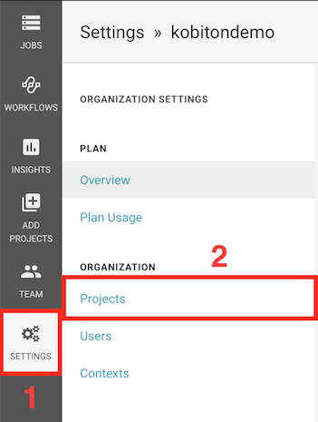
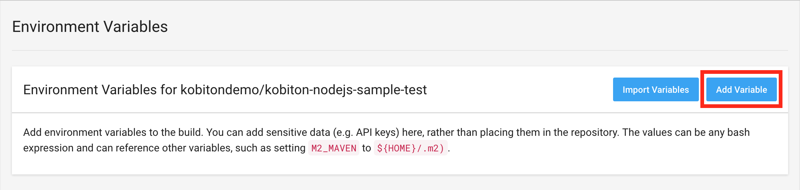

# Run Kobiton Automation Test on CircleCI

## Table of contents

- [Prerequisites](#prerequisites)

- [1. Configuring GitHub repository to be used with CircleCI](#1-configuring-github-repository-to-be-used-with-circleci)

- [2. Getting required parameters](#2-getting-required-parameters)

- [3. Configuring automation test script](#3-configuring-automation-test-script)

- [4. Configuring CircleCI with Kobiton](#4-configuring-circleci-with-kobiton)

- [5. Executing the automated test script](#5-executing-the-automated-test-script)

- [6. Viewing Kobiton test session information](#6-viewing-kobiton-test-session-information)

## Prerequisites
- An active Kobiton subscription.
    > - If your don't have one, go to [here](https://portal.kobiton.com/register) and follow their instruction to create an account.
- An active CircleCI subscription.
    > - If you don't have one, go to [here](https://circleci.com/signup/) and follow their instruction to create an account.
- A blank GitHub repository to be used for automation testing with CircleCI.

## 1. Configuring GitHub repository to be used with CircleCI
This part will guide you how to configure and synchronize your repository with CircleCI.

If you have already had a blank, configured repository for automation testing with CircleCI or known how to it, skip this step.

> For instruction on how to setup and synchronize a GitHub repository with CircleCI, follow [this](https://circleci.com/docs/2.0/getting-started/) guide.

## 2. Getting required parameters
In order to execute test(s) on Kobiton, these three must-have parameters must be provided : Username, API key, desired capabilities. This part will demonstrate how to get those elements

### 2.1 Getting Username and API Key

Go to [https://portal.kobiton.com](https://portal.kobiton.com) and login with your Kobiton account.

To get your username, follow these steps:

- Click your user icon -> **"Profile"**

- You will see your username (marked **red**)


To get your API key, follow these steps:

- Click your user icon -> **"Settings"**

- You will see your API key (marked **red**)


### 2.2 Getting desired capabilities and Kobiton server web driver configuration

1. Go to [here](https://portal.kobiton.com/login) and login with your Kobiton account
2. Click **"Devices"** at the top of the window


3. At the top left of the page, you will see the device status filter (`online`, `busy`, `offline`). Leave only `Online` ticked to display only online devices


4. Hover over the device you want to run your test script on, click the gear button


5. In the popup window, choose the language that your script will be written in, change the value of **"App Type"** to **"Hybrid/Native from Apps"**. The desired capabilities and Kobiton server web driver configuration code will be generated and displayed in the right pane of the popup (marked **blue**).


6. Write down the generated code as we will be using it later.

## 3. Configuring automation test script
> You can visit [our blog](https://kobiton.com/blog/automation-web-appium-kobiton-nodejs/) for details on how to set up an automation test script.

Kobiton has already provided sample test scripts written in many languages, visit [here](https://github.com/kobiton/samples) for reference. In this example, we will be using the ones written in `NodeJS` (in `samples/javascript` folder).

Copy contents of `samples/javascript` folder to your repository.

You will see many testing scripts. Choose `android-app-test.js` if you want to run tests on `Android` or `ios-app-test.js` if on `iOS`.

### 3.1 Setting Username and API key

There are two ways to set your username and API key, you can choose either one of them :
+ Set as project's global environment variables in CircleCI.
+ Set in the testing script.

**Approach 1 : Setting Username and API key project's global environment variables in CircleCI**

1. Go to [CircleCI dashboard](https://circleci.com/dashboard)

2. In the left panel of the page, click `Settings` -> `Projects`



3. In `Followed projects` section, click the gear icon in the project you want to configure.


4. In the left pane of the window, click `Environment variables` button under `Build Settings` section


5. In `Environment Variables` window, click `Add Variable`



6. In `Add an Environment Variable` popup, fill in `Name` field with the one in the picture (marked **red**). In `Value` field, replace `YOUR_KOBITON_USERNAME` (marked **blue**) with your Kobiton username. Click `Add Variable`


Repeat step 5, 6, 7, replace `YOUR_KOBITON_API_KEY` (marked **blue**) with your Kobiton API key 


Your `Environment Variables` window should look like this


**Approach 2 : Setting Username, API Key in the testing script**

1. Open the chosen script

2. Replace `username`, `apiKey` values with your Kobiton's username, API key taken above. The result should look like this

```javascript
const username = '<YOUR_KOBITON_NAME>'
const apiKey = '<YOUR_KOBITON_API_KEY>'
```

### 3.2 Setting Desired Capabilities

1. Open the chosen script

2. Replace `desiredCaps` value with the one taken above. The result should look like this

```javascript
var kobitonServerConfig = {
  protocol: 'https',
  host: 'api.kobiton.com',
  auth: '${username}:${apiKey}'
}

var desiredCaps = {
  sessionName:        'Automation test session',
  sessionDescription: '', 
  deviceOrientation:  'portrait',  
  captureScreenshots: true, 
  app:                '<YOUR_APP_URL>', 
  deviceGroup:        'KOBITON', 
  deviceName:         '<DEVICE_NAME>',
  platformVersion:    '<PLATFORM_VERSION>',
  platformName:       '<PLATFORM_NAME>' 
}
```

## 4. Configuring CircleCI with Kobiton

Next, follow these steps below to modify CircleCI configuration file `config.yml` to execute the test script.

1. Choose docker image(s)

    Because building and execution processes are done in isolated containers (CircleCI uses Docker as container management), therefore, we have to choose an image that suite your application requirements.

    List of images can be found [here](https://circleci.com/docs/2.0/circleci-images/#latest-image-tags-by-language).

    In this guide, we will be using latest version of NodeJS, therefore, we will use CircleCI's official latest NodeJS image **circleci/node:latest**

    Replace `docker` section with the chosen image
    
    ```yaml
    docker:
      - image: circleci/node:latest
    ```

2. Modify CircleCI configuration file
    
    To update `npm` to the latest version, in `steps` section, add the following lines under `checkout`

    ```yaml
    - run:
        name: update-npm
        command: 'sudo npm install -g npm@latest'
    ```

    Because the provided scripts use 3rd party libraries, thus we will have to install them using npm.

    In `steps` section, add the following lines under `update-npm` section

    ```yaml
    - run:
        name: npm-install-dependencies
        command: npm install
    ```

    To execute the chosen script, in `steps` section, add the following lines under `npm-restore-deps` section

    ```yaml
    - run:
        name: android-app-test
        command: npm run <YOUR_SCRIPT_FILENAME>
    ```

    The contents of `config.yml` should look like this
    
    ```yaml
    version: 2
    jobs:
    build:
        working_directory: ~/sample
        docker:
            - image: circleci/node:latest
        steps:
            - checkout
            - run:
                name: update-npm
                command: 'sudo npm install -g npm@latest'
            - run:
                name: npm-install-dependencies
                command: npm install
            - run:
                name: android-app-test
                command: npm run <YOUR_SCRIPT_FILENAME>
    ```

### 5. Executing the automated test script

Simply push all changes to your repository and CircleCI will execute the script. To view the execution progress in CircleCI, follow these steps below

1. Go to [CircleCI dashboard](https://circleci.com/dashboard)

2. Click on the title of the test to see its details


3. Test details should look like this


### 6. Viewing Kobiton test session information

There are two ways to view your Kobiton test session information :
- On Kobiton website.
- Using REST API.

**On Kobiton website**

1. Go to [https://portal.kobiton.com/sessions](https://portal.kobiton.com/sessions), login with your Kobiton account.

2. You will see your executed sessions and their statuses.


3. Click on any session to view its details, commands.

**Using REST API**

Besides viewing on website, your session details can also be retrieved using Kobiton's REST API. Follow follow [this](https://github.com/kobiton/samples/rest-api/README.md) tutorial for reference.