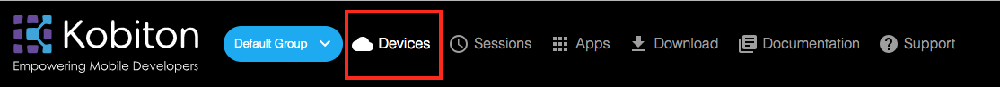

# Run Kobiton Automation Test on CircleCI

This document will guide you how to use CircleCI to execute automation test on Kobiton devices everytime you push a commit to GitHub.

## Table of contents
- [A. Preparation](#a-preparation)
    - [1. Getting Kobiton Username and API key](#1-getting-kobiton-username-and-api-key)
    - [2. Samples](#2-samples)
- [B. Setup](#b-setup)
    - [Purposes](#purposes)
    - [1. Setting Kobiton Username and API Key](#1-setting-kobiton-username-and-api-key)
    - [2. Getting Kobiton device desired capabilities](#2-getting-kobiton-device-desired-capabilities)
    - [3. Configuring automation test script](#3-configuring-automation-test-script)
- [C. Automation Test Execution](#c-automation-test-execution)
    - [1. Executing the automation test](#1-executing-the-automation-test)
    - [2. Fetching test session data using Kobiton REST API](#2-fetching-test-session-data-using-kobiton-rest-api)
- [D. Feedback](#d-feedback)

## A. Preparation
### 1. Getting Kobiton Username and API key
Kobiton Username and API key are required for authenticating with Kobiton.

> If you don't have a Kobiton account, visit https://portal.kobiton.com/register to create one.

To get your Kobiton Username and API Key, follow instruction at `IV. Configure Test Script for Kobiton` section on [our blog article](https://kobiton.com/blog/tutorial/parallel-testing-selenium-webdriver/).

### 2. Samples
In this repository, we have already provided samples for executing automation test in Kobiton:
- Script for executing automation test on Kobiton iOS devices (`/samples/ios-app-test.js`).
- Script for executing automation test on Kobiton Android devices (`/samples/android-app-test.js`).
- CircleCI configuration file (`/.circleci/config.yml`).

Link to the sample(s): https://github.com/kobiton/CircleCI-HockeyApp-Appium-ReactNative/tree/master/samples

In this guide, as we will be using the provided example, therefore, follow these steps below:

1. Fork this repository https://github.com/kobiton/CircleCI-HockeyApp-Appium-ReactNative

2. Synchronize the forked repository with CircleCI. If you don't know how to do it, refer to instruction at [CircleCI document](https://circleci.com/docs/2.0/getting-started/)

> Note : At first synchronization, the build process will be failed to execute. This is normal, just ignore the `Build Failed` message.

3. Clone the forked repository as we will be modifying it later.

## B. Setup
### 1. Setting Kobiton Username and API key

In your project configuration in CircleCI, add these two environment variables :
- KOBITON_USERNAME - Your Kobiton's username.
- KOBITON_API_KEY - Your Kobiton's API Key.

Your `Environment Variables` window should look like this


### 2. Getting Kobiton device desired capabilities
In order to interact with a specific device in Kobiton, its corresponding desired capabilities needs to be supplied. In this example, we will be demonstrating how to get desired capabilities to execute `ApiDemos-debug` application on `Pixel 2 XL` running `Android 8.1.0`.

1. Go to [https://portal.kobiton.com/login](https://portal.kobiton.com/login) and login with your Kobiton account.
2. Click **"Devices"** at the top of the window.



3. Hover over the device you want to run your test script on, click the gear button.


4. In the popup window:
- In `Language` section, choose `NodeJS`.

- In `App Type` section, choose `Hybrid/Native from Url`.

- In `Application Url` field, replace with URL of `ApiDemos-debug` application:
    > https://appium.github.io/appium/docs/assets/ApiDemos-debug.apk


To demonstrate automation testing on iOS, repeat above steps with an iOS device (in this example, we will be using `iPhone 8 Plus` running `iOS 11.0`) and replace the `Application URL` field with the URL of `UIKitCatalog-Test-Adhoc` application:
> https://s3-ap-southeast-1.amazonaws.com/kobiton-devvn/apps-test/UIKitCatalog-Test-Adhoc.ipa


### 3. Modifying scripts and configuration file

#### 3.1 Configuring automation test script
In `samples/automation-test` folder, we have provided two sample scripts for executing automation test on Kobiton iOS and Android devices.

1. Open `android-app-test.js` if you want to execute test on Android or `ios-app-test.js` if on iOS.

2. Replace `desiredCaps` value with the one taken above.

Desired Capabilities for executing mentioned sample applications:

For Android devices:

```javascript
const desiredCaps = {
  sessionName:        'Automation test session',
  sessionDescription: 'Demo Automation Test on Android', 
  deviceOrientation:  'portrait',  
  captureScreenshots: true, 
  app:                'https://appium.github.io/appium/docs/assets/ApiDemos-debug.apk',
  deviceGroup:        'KOBITON', 
  deviceName:         'Pixel 2 XL',
  platformVersion:    '8.1.0',
  platformName:       'Android' 
}
```

For iOS devices:

```javascript
const desiredCaps = {
  sessionName:        'Automation test session',
  sessionDescription: 'Demo Automation Test on iOS', 
  deviceOrientation:  'portrait',  
  captureScreenshots: true, 
  app:                'https://s3-ap-southeast-1.amazonaws.com/kobiton-devvn/apps-test/UIKitCatalog-Test-Adhoc.ipa', 
  deviceGroup:        'KOBITON', 
  deviceName:         'iPhone 8 Plus',
  platformVersion:    '11.0',
  platformName:       'iOS' 
}
```

> More information about Desired Capabilities and its parameters can be found in https://docs.kobiton.com/automation-testing/desired-capabilities-usage/

#### 3.2 Modifying CircleCI configuration file
**Execution environment**

As the automation testing script is written in NodeJS, which requires the execution environment to have NodeJS installed, therefore, we will be using CircleCI official latest NodeJS container `circleci/node:latest` as the execution environment.

In the provided CircleCI configuration file `.circleci/config.yml`, the execution environment has already been set to using the mentioned container.

```yaml
docker:
    - image: circleci/node:latest
```

> For more information about how to execute automation test(s) on Kobiton, you can visit:
> - Kobiton documentation: https://docs.kobiton.com/automation-testing/automation-testing-with-kobiton/
> - Kobiton's samples for automation test scripts in other languages: https://github.com/kobiton/samples

**Modifying the configuration file to execute the automation test script**

1. Open CircleCI configuration file `/.circleci/config.yml`

2. Replace `<SCRIPT_FILENAME>` with `android-app-test` if you want to execute automation test on Android or `ios-app-test` if on iOS.

Example : 
- For executing automation test on Android :

```yaml
- run:
    name: app-auto-testing
    command: npm run android-app-test
    working_directory: samples/automation-test
```

- For executing automation test on iOS :
```yaml
- run:
    name: app-auto-testing
    command: npm run ios-app-test
    working_directory: samples/automation-test
```

## C. Execution
### 1. Executing the automation test

Simply push your modified test script(s) and CircleCI configuration file `/.circleci/config.yml` to your GitHub repository. CircleCI will automatically configure the execution environment, install missing dependencies and execute the test script in `/samples` based on the provided configuration file `/.circleci/config.yml`

Your test execution process can be viewed on CircleCI


Your test session progress can be viewed on Kobiton website. Follow these steps below

1. Go to [https://portal.kobiton.com/sessions](https://portal.kobiton.com/sessions), login with your Kobiton account.

2. You will see your executed sessions and their statuses.


3. Click on any session to view its details, commands.

### 2. Fetching test session data using Kobiton REST API

Kobiton has already provided samples written in NodeJS to get session information, commands using Kobiton REST API.
Go to https://github.com/kobiton/samples/tree/master/kobiton-rest-api and follow the instructions.

## D. Feedback

If you have any issue or further information, follow steps below to request Kobiton for support.

1. Go to [https://portal.kobiton.com](https://portal.kobiton.com)
2. In the navigation bar at the top of the page, click `Support`.


3. Fill in the necessary information and click `Submit`.

